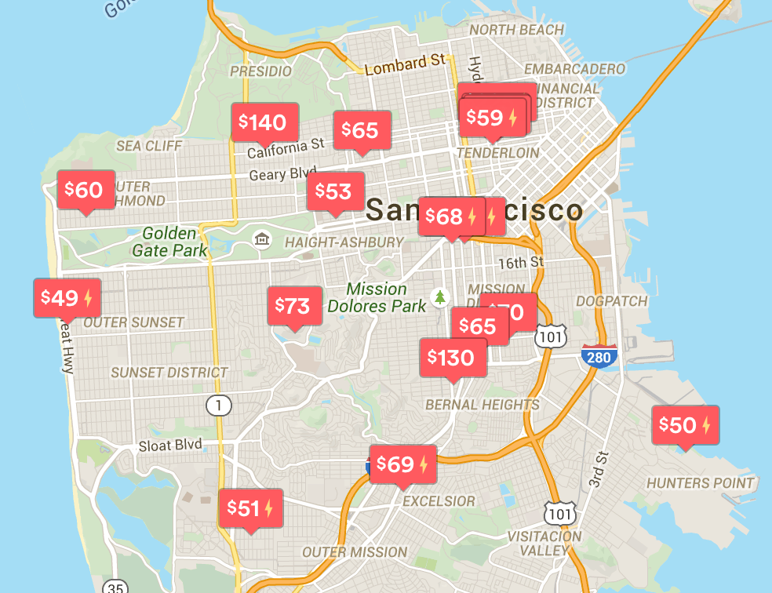

## Data Sciense Flow

* Understand problem
* Collect data
* Explore data
* Clean and transform
* Model
* Validate
* Communicating results
* Deploy


## San-Francisco


## Rent appartment




## Obtain Data

Data from San Francisco Open Data https://data.sfgov.org/

```{r}
crimes <- read.csv("SFPD_Incidents_-_from_1_January_2003.csv")
crimes <- crimes[complete.cases(crimes), ]
head(crimes)
```

## Load Libraries

* tidyr, dplyr - data preprocessing
* lubridate - dates preprocessing
* ggplot2, ggmap - data visualisation
* e1071 - machine learning stuff

```{r, include=FALSE, cache=FALSE}
library(tidyr)
library(dplyr)
library(ggplot2)
library(ggmap)
library(lubridate)
library(e1071)
```


## Feature Engineering

```{r}

crimes$Dates <- mdy(crimes$Date)
crimes$hour <- as.factor(substr(crimes$Time, 1, 2))
crimes$year <- year(crimes$Dates)
crimes$day <- day(crimes$Dates)
crimes$month <- month(crimes$Dates)
crimes$DayOfWeek <- factor(crimes$DayOfWeek , levels = c("Monday", "Tuesday", "Wednesday", 
                                                         "Thursday", "Friday", "Saturday",
                                                         "Sunday"))

```


## Explore crimes over time:
```{r, echo=FALSE}
# Year summary
table(crimes$year)
N_crimes_per_day <- count(crimes, Dates)

p <- ggplot(N_crimes_per_day, aes(x=Dates, y=n)) +
  geom_line() +
  geom_smooth() + 
  ggtitle("Crimes over time")
p
```


## Explore crimes by districts:
```{r, echo=FALSE}
N_crimes_per_day_district <- crimes %>%
  dplyr::group_by(Dates, PdDistrict) %>%
  dplyr::summarise(count=n()) 

p <- ggplot(N_crimes_per_day_district, aes(x=Dates, y=count, col=PdDistrict)) +
  geom_point()  + geom_smooth()
p
```

## Make District plot more understandable
```{r, echo=FALSE}
p <- ggplot(N_crimes_per_day_district, aes(x=PdDistrict, y=count)) + 
  geom_boxplot()
p
```

## Lets explore day of the week:
```{r, echo=FALSE}
N_crimes_per_day_district_day <- crimes %>%
  dplyr::group_by(Dates, PdDistrict, DayOfWeek) %>%
  dplyr::summarise(count=n()) 

p <- ggplot(N_crimes_per_day_district_day, aes(x=DayOfWeek, y=count)) + 
  geom_boxplot() 
p
```

## How about crimes categories?

```{r, echo=FALSE}
N_category_district <- crimes %>%
  dplyr::group_by(Category, PdDistrict, DayOfWeek) %>%
  dplyr::summarise(count=n())


p <- ggplot(N_category_district, aes(x=Category, y=count)) + 
  geom_boxplot() +
  theme(axis.text.x = element_text(angle = 90, hjust = 1))
p

```

## Lets analyse LARCENY/THEFT category

```{r, echo=FALSE, warning=FALSE, comment=FALSE}
theft <- crimes[crimes$Category == "LARCENY/THEFT", c("Category", "X", "Y")]

map <- get_map(location="sanfrancisco",zoom=13,source="osm")
p1 <- ggmap(map) + 
  geom_point(data=theft, aes(x=X, y=Y), color="blue") +
  theme(legend.position = "none", axis.title = element_blank(), text = element_text(size = 12))
p1

```


##  LARCENY/THEFT density
```{r, echo=FALSE, warning=FALSE}
p1 <- ggmap(map) + 
  geom_point(data=theft, aes(x=X, y=Y), alpha=0.1, color="blue") +
  stat_density2d(data=theft, aes(x=X, y=Y, fill = ..level.., alpha = ..level..), size=2.0, color='red', geom = 'polygon') +
  theme(legend.position = "none", axis.title = element_blank(), text = element_text(size = 12))
p1
```

## Lets analyse crimes, which could affect tourists: 

* LARCENY/THEFT
* VEHICLE THEFT
* STOLEN PROPERTY
* ROBBERY
* ASSAULT
* EXTORTION

```{r, echo=FALSE}
tourists_crimes <-  crimes[crimes$Category %in% c("LARCENY/THEFT","VEHICLE THEFT", "STOLEN PROPERTY" ,"ROBBERY", "ASSAULT", "EXTORTION"), ]

```

## Crimes structure for districts:
```{r, echo=FALSE}

cat_district <- tourists_crimes %>% 
  group_by(Category, PdDistrict) %>%
  summarise(count_s=n()) %>%
  ungroup()


p <- ggplot(cat_district, aes(PdDistrict, count_s, fill=Category)) +  
  geom_bar(stat='identity') +
  coord_flip()
p
```

## Lets plot this crimes on map

```{r, echo=FALSE, warning=FALSE}

p <- ggmap(map) +
  geom_point(data=tourists_crimes, aes(x=X, y=Y), alpha=0.01, color='blue') +
  stat_density2d(data=tourists_crimes, aes(x=X, y=Y), size=0.8, color='red', geom = 'polygon') +
  ggtitle("Potential crimes in San Francisco") + 
  facet_grid(.~ Category)
p
```


## Find most dangerous locations
```{r, echo=FALSE, warning=FALSE}
dangerous_coord <- tourists_crimes %>%
  group_by(PdDistrict, Address, X, Y) %>%
  summarise(count_s=n()) %>%
  filter(count_s >= 100) %>%
  arrange(desc(count_s))

filtered_dangerous_coord <- dangerous_coord %>%
  select(PdDistrict, Address, count_s) %>%
  arrange(desc(count_s))

head(filtered_dangerous_coord)
```

## Most dangerous locations on map

```{r, echo=FALSE, warning=FALSE}
map <- get_map(location="sanfrancisco",zoom=14,source="osm")
p <- ggmap(map) +
  geom_point(data = dangerous_coord, aes(X, Y), colour = "red", size = dangerous_coord$count_s/100, alpha=1/2)
p

```

## Prediction part

1. Define new catergory: tourists_threat.

2. tourists_threat == 'yes' for rows where category is in "LARCENY/THEFT","VEHICLE THEFT", "STOLEN PROPERTY" ,"ROBBERY", "ASSAULT", "EXTORTION"

3. Split data into two parts: 80% - train, 20% - test

```{r, echo=FALSE}

crimes$tourusits_threat <- "no"
crimes$tourusits_threat[crimes$Category %in% c("LARCENY/THEFT","VEHICLE THEFT", "STOLEN PROPERTY" ,"ROBBERY", "ASSAULT", "EXTORTION" )] <- "yes"

train_size <- nrow(crimes)*0.8
train_ind <- sample(nrow(crimes), train_size)

train <- crimes[train_ind, ]
test  <- crimes[-train_ind, ]
train$tourusits_threat <- as.factor(train$tourusits_threat)

```

## Naive Bayes


## Classification
```{r}
m1 <- naiveBayes(as.factor(tourusits_threat) ~ PdDistrict + DayOfWeek + hour, data = train, laplace = 1)
m1

```

## Prediction

Apply our trained model for the test data

```{r, echo=FALSE, warning=FALSE}
pred_nb <- predict(m1, test)
table(pred_nb, test$tourusits_threat)

```

## Validation

```{r}
table(pred_nb, test$tourusits_threat)
```


